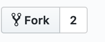
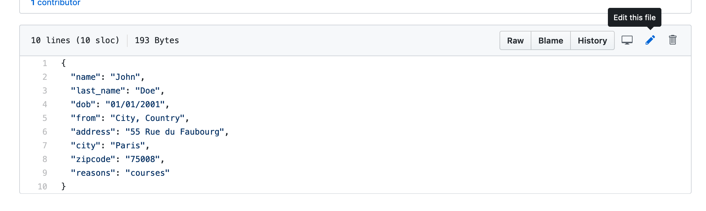
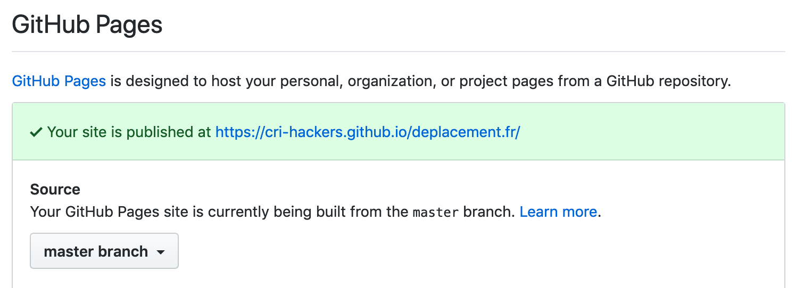

# Living in France? Quickly make your own attestations to leave during COVID-19

A very simple test deployment can be found at [on our GitHub page](https://cri-hackers.github.io/deplacement.fr/).

This little re-wrapping of the official digital attestation generator of the French government comes with a small set of useful features to make going out for grocery shopping easier in times of the lockdown:

- English frontend? Yes, please!
- Automatically fill your personal & location information
- In a pinch even use your current GPS location to fill your address
-  Backdate your attestations to make them look like you filled them out 25 minutes ago, for those times you head out and forget to generate a new PDF

## Setting up your own attestation generator

To make this little thing quickly generate forms in your own name you can use GitHub pages to deliver a fork of this, that replaces the demo data with your own data. Here's a step-by-step instruction:

### 1. Make a fork of this repository by clicking the little button on top of this page



### 2. Edit the `attestation_config.json` file in your fork.



```
{
  "name": "John",
  "last_name": "Doe",
  "dob": "01/01/2001",
  "from": "City, Country",
  "address": "55 Rue du Faubourg",
  "city": "Paris",
  "zipcode": "75008",
  "reasons": "courses"
}
```

By default the configuration looks like this. You can change the name, address etc. to match your own data. If you want to give multiple reasons for leaving the house in your configuration you can do so using `-` as a separator (e.g. `travail-courses`). The available options are: `travail`, `courses`, `sante`, `famille`, `sport`, `judiciaire` and `missions`.

### 3. Enable GitHub pages for your fork



Go to the Settings of your fork and scroll down until you see `Github Pages` as an option item. Select the `master` branch as the one to deliver the actual webpage.

### 4. Profit

That's it. If you head to https://your_github_username.io/deplacement.fr you should see the page with your details pre-filled.

Happy leaving the house in a hurry.


## Acknowledgements

We gotta thank the developers the French government hired for doing the electronic attestations in the first place and their commitment to "open source code", as most of the code for this is directly ripped from Javascript that's deployed on the official website. Which also means that the __attestations generated by this little page should be identical to the ones provided by the official website__!

We just did some minor changes to make filling the form out much quicker. And gave the frontend an English language interface, as the English government website is so outdated that they still even claim that France isn't quarantined. 🤷‍♀️
